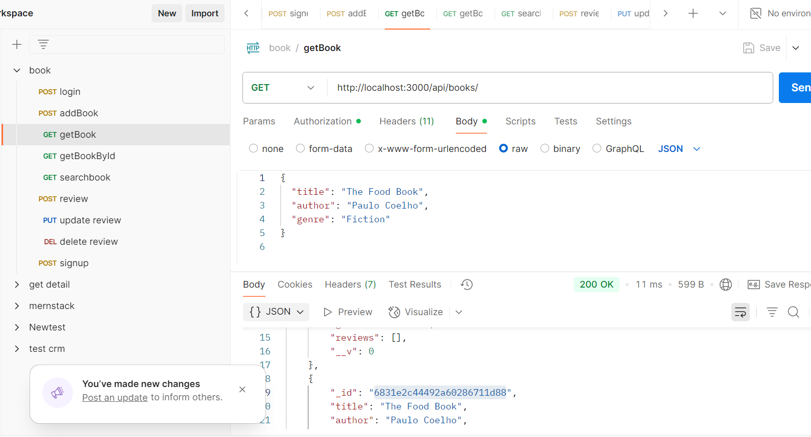

# 📚 Book Review API

A RESTful API built with **Node.js**, **Express**, and **MongoDB** that allows users to sign up, log in, manage books, and leave reviews. JWT-based authentication is implemented to protect certain routes.

---

## 🚀 Features

- User Signup and Login (JWT Auth)
- Add/Search/List/View Books
- Add/View/Update/Delete Reviews
- Pagination and Search Filters
- MongoDB with Mongoose ODM
- Protected Routes using Middleware


## 🧱 Tech Stack

- Node.js
- Express.js
- MongoDB & Mongoose
- JWT (Authentication)
- bcryptjs (Password Hashing)
- EJS (View Engine)


## ⚙️ Setup Instructions

### 1. Clone the Repository

```bash
git clone https://github.com/yourusername/book-review-api.git
cd book-review-api

### 2. Install Dependencies
npm install


### 3. Configure Environment Variables
Create a .env file in the root directory and add the following:

PORT=3000
MONGO_URI=mongodb://localhost:27017/bookreview
JWT_SECRET=jaishreeram


4. Start the Server
npm start

Server runs on http://localhost:3000


📬 API Endpoints

🔐 Auth Routes


| Method | Endpoint           | Description     |
| ------ | ------------------ | --------------- |
| POST   | `/api/auth/signup` | Register a user |
| POST   | `/api/auth/login`  | Login a user    |


📚 Book Routes


| Method | Endpoint               | Description                      |
| ------ | ---------------------- | -------------------------------- |
| GET    | `/api/books`           | Get all books                    |
| GET    | `/api/books/search?q=` | Search books by title or author  |
| GET    | `/api/books/:id`       | Get single book by ID            |
| POST   | `/api/books`           | Add a new book *(auth required)* |


📝 Review Routes


| Method | Endpoint                 | Description                            |
| ------ | ------------------------ | -------------------------------------- |
| POST   | `/api/books/:id/reviews` | Add review to a book *(auth required)* |
| PUT    | `/api/reviews/:id`       | Update a review *(auth required)*      |
| DELETE | `/api/reviews/:id`       | Delete a review *(auth required)*      |

🔐 Authentication
Send JWT token in the header as:

Authorization: Bearer <token>

🧪 Testing the API

You can use tools like Postman  to test the API endpoints.

Sample Signup Request

POST /api/auth/signup
{
  "username": "testuser",
  "password": "123456"
}


Sample Login Request

POST /api/auth/login
{
  "username": "testuser",
  "password": "123456"
}

Returns a token:
{
  "token": "your_jwt_token"
}

Use this token for protected routes.


📘 BOOK API
📚 Get All Books 
Endpoint: GET /api/books




📚 Get  Books By Id
:id  is a bookid
Endpoint: GET /api/books/:id

![Get By Book Id] (assets/getbookbyid.png)


📚 Add  Books 
:id  is a bookid
Endpoint: POST /api/books/

![Add Book] (assets/addbook.png)

📚 Search Book by using query parameter by title ,author ,genre 
Endpoint: GET /api/books/search?q=Paulo


![search book] (assets/searchbook.png)


📚 Update Review:-
:id is a review id
Endpoint: PUT /api/reviews/:id

![update review by review id ] (assets/update review.png)


📚 Delete Review:-
:id is a review id
Endpoint:DELETE /api/reviews/:id

![delete review] (assets/delete review.png)


📚 Add Review:-
:id is a review id
Endpoint:DELETE /api/reviews/:id

![add review] (assets/addreview.png)


